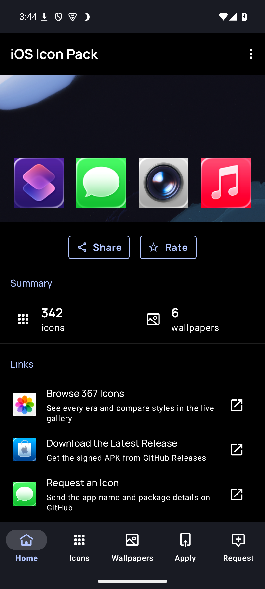
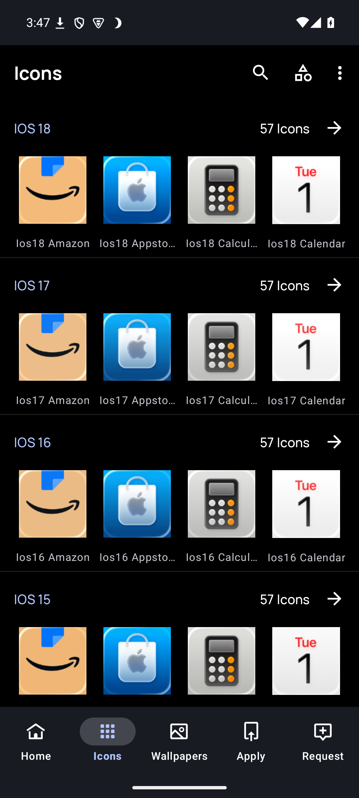
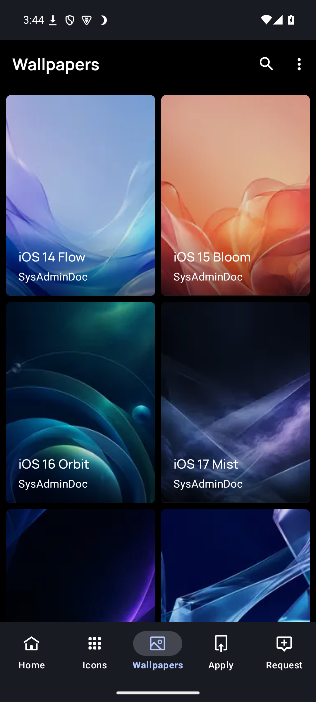
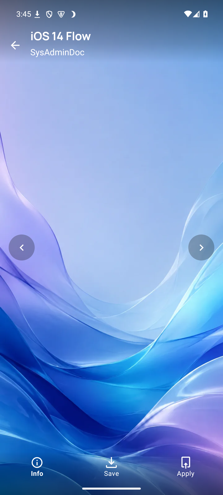
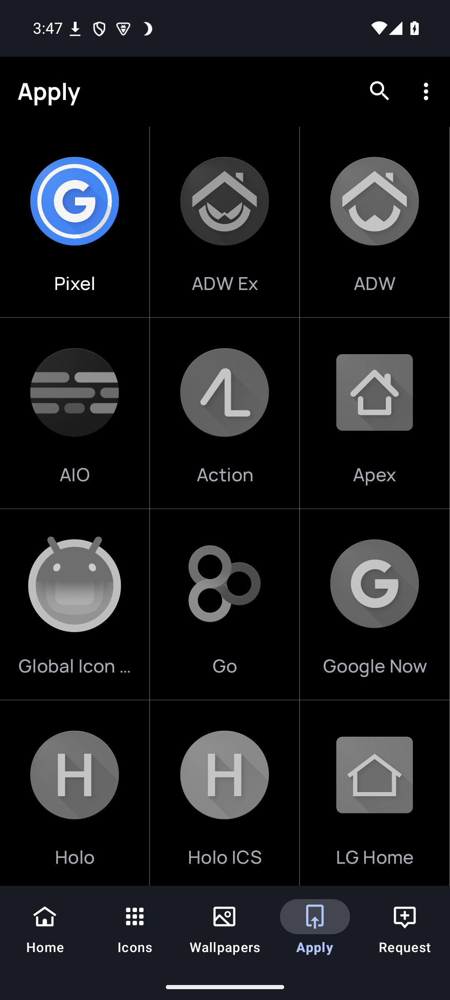
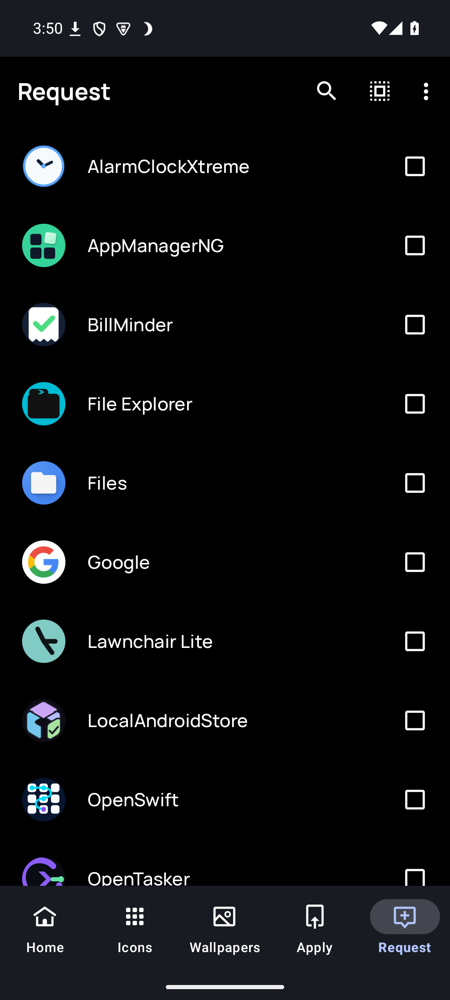

<p align="center">
  
</p>

<h1 align="center">iOS Icon Pack</h1>

<p align="center">
  Give Android an iOS-inspired home screen. Choose from six visual eras with themed icons and original wallpapers.
</p>

<p align="center">
  
  
  
  
</p>

<p align="center">
  <a href="https://sysadmindoc.github.io/iOSIconPack/"><strong>Browse all icons</strong></a>
  &nbsp;&middot;&nbsp;
  <a href="https://github.com/SysAdminDoc/iOSIconPack/releases/latest"><strong>Download the APK</strong></a>
  &nbsp;&middot;&nbsp;
  <a href="https://apps.obtainium.imranr.dev/redirect?r=obtainium://app/%7B%22id%22:%22com.sysadmindoc.iosicons%22,%22url%22:%22https://github.com/SysAdminDoc/iOSIconPack%22,%22author%22:%22SysAdminDoc%22,%22name%22:%22iOS%20Icon%20Pack%22,%22additionalSettings%22:%22%7B%5C%22apkFilterRegEx%5C%22:%5C%22release%5C%22%7D%22%7D"><strong>Add to Obtainium</strong></a>
</p>

## See it in action

| Home | Icon browser | Wallpapers |
|:---:|:---:|:---:|
|  |  |  |
| **Wallpaper preview** | **Apply the pack** | **Request an icon** |
|  |  |  |

## What you get

- **Six iOS eras.** Browse iOS 14, 15, 16, 17, 18, and the iOS 26 Liquid Glass look. Each era includes 57 matching icons.
- **367 raster icons.** The catalog combines 342 era variants with 25 exact icons for popular third-party apps.
- **Broad app coverage.** 671 component mappings connect the artwork to common Android apps and system tools.
- **Android themed icons.** Every catalog icon includes a monochrome vector and a transparent glyph variant.
- **Six original wallpapers.** Each included background was designed for this pack and works offline.
- **No ads or tracking.** There are no analytics SDKs, in-app purchases, or license checks.

The default app mapping uses the iOS 18 set. You can still browse every era in the dashboard and choose individual alternatives through launchers that provide an icon picker.

## Install

You need a launcher that accepts third-party icon packs. Nova, Lawnchair, Niagara, Action Launcher, Smart Launcher, Apex, ADW, OnePlus Launcher, and Projectivy are supported. Samsung users can apply packs through Theme Park. Stock Pixel Launcher does not offer a third-party icon-pack picker.

### Obtainium

1. Install [Obtainium](https://github.com/ImranR98/Obtainium/releases/latest).
2. Open the [iOS Icon Pack Obtainium link](https://apps.obtainium.imranr.dev/redirect?r=obtainium://app/%7B%22id%22:%22com.sysadmindoc.iosicons%22,%22url%22:%22https://github.com/SysAdminDoc/iOSIconPack%22,%22author%22:%22SysAdminDoc%22,%22name%22:%22iOS%20Icon%20Pack%22,%22additionalSettings%22:%22%7B%5C%22apkFilterRegEx%5C%22:%5C%22release%5C%22%7D%22%7D) on your phone.
3. Install the latest signed release, then select iOS Icon Pack in your launcher's appearance settings.

### Manual install

Download `iOSIconPack-v1.2.5-release.apk` from [GitHub Releases](https://github.com/SysAdminDoc/iOSIconPack/releases/latest). Android 8.0 or newer is required.

## Icon coverage

| Collection | Count | Purpose |
|---|---:|---|
| Era artwork | 342 | 57 icons across each of six iOS styles |
| Exact third-party artwork | 25 | Recognizable icons for apps without an Apple counterpart |
| App component mappings | 671 | Package and activity matches used by Android launchers |
| Monochrome vectors | 367 | Material You themed-icon support |
| Transparent glyphs | 367 | Alternate artwork for supported launchers and widgets |
| Original wallpapers | 6 | Offline backgrounds matched to the six eras |

The [live gallery](https://sysadmindoc.github.io/iOSIconPack/) lists every shipped icon and makes it easy to compare eras before installing.

## Privacy

iOS Icon Pack does not collect analytics, show ads, or sell data. The optional icon-request flow can include package names and basic device details so missing apps can be mapped correctly. Nothing is uploaded unless you submit the GitHub request.

## Build locally

Android Studio, its bundled JDK, Python 3, and Pillow are required.

```bash
python -m pip install -r requirements.txt
./gradlew test lintRelease assembleDebug
python scripts/icontool.py check
python scripts/gen_gallery.py --check
```

Maintainers can run the complete local release gate with:

```bash
python scripts/icontool.py preflight
```

Official APKs use the maintainer's release key. The committed development keystore is only for local test builds.

## Contribute an icon

The contributor tool updates the icon catalog and package mappings together:

```bash
python scripts/icontool.py add ios18_appname \
  -c "com.example.app/com.example.app.MainActivity"
python scripts/icontool.py check
```

Read [CONTRIBUTING.md](CONTRIBUTING.md) for artwork sizing, naming, provenance, and review checks. Missing something? [Open an icon request](https://github.com/SysAdminDoc/iOSIconPack/issues/new?template=icon-request.yml&labels=icon-request).

## Credits

The Android dashboard is built with [Blueprint](https://github.com/jahirfiquitiva/Blueprint) by Jahir Fiquitiva.

## License

Released under the [MIT License](LICENSE).
