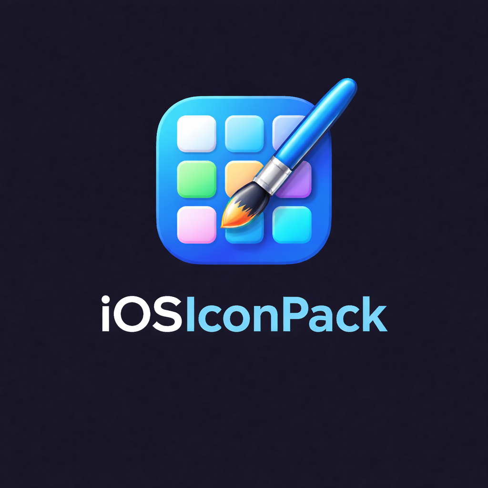

<p align="center"></p>

<h1 align="center">iOS Icon Pack</h1>

<p align="center">
  
  
  
  
</p>

<p align="center">
  <a href="https://apps.obtainium.imranr.dev/redirect?r=obtainium://app/%7B%22id%22:%22com.sysadmindoc.iosicons%22,%22url%22:%22https://github.com/SysAdminDoc/iOSIconPack%22,%22author%22:%22SysAdminDoc%22,%22name%22:%22iOS%20Icon%20Pack%22,%22additionalSettings%22:%22%7B%5C%22apkFilterRegEx%5C%22:%5C%22release%5C%22%7D%22%7D">
    
  </a>
  <a href="https://github.com/SysAdminDoc/iOSIconPack/releases/latest">
    
  </a>
</p>

The ultimate iOS-style icon pack for Android. Every iOS generation in one app — pick and choose which era's icons to apply per-app.

## Install

**Obtainium (recommended — auto-updates):**

1. Install [Obtainium](https://github.com/ImranR98/Obtainium/releases/latest)
2. Tap this link on your phone:
   [`obtainium://add/https://github.com/SysAdminDoc/iOSIconPack`](https://apps.obtainium.imranr.dev/redirect?r=obtainium://app/%7B%22id%22:%22com.sysadmindoc.iosicons%22,%22url%22:%22https://github.com/SysAdminDoc/iOSIconPack%22,%22author%22:%22SysAdminDoc%22,%22name%22:%22iOS%20Icon%20Pack%22,%22additionalSettings%22:%22%7B%5C%22apkFilterRegEx%5C%22:%5C%22release%5C%22%7D%22%7D)
3. Install the latest APK and apply the icon pack in your launcher

**Manual:** Download the APK from [Releases](https://github.com/SysAdminDoc/iOSIconPack/releases/latest), install, then select the pack in your launcher's icon pack settings.

## Features

- **6 iOS Eras** — iOS 14, 15, 16, 17, 18, and iOS 26 Liquid Glass
- **Mix & Match** — Apply different generations to different apps
- **135 Icons + 247 appfilter entries** — 110 iOS stock across 6 eras + 25 dedicated third-party (Instagram, WhatsApp, Spotify, Netflix, YouTube…), and 247 component mappings covering popular Android apps
- **Monochrome themed launcher icon** — Android 13+ dynamic theming support
- **30+ Launcher Support** — Nova, Lawnchair, Smart Launcher, OnePlus, Samsung, Niagara, Microsoft Launcher, POCO, Pixel, and more
- **AMOLED Dark Theme** — Native dark mode dashboard
- **Icon Requests** — Request icons for apps not yet covered
- **Free & Open Source** — No ads, no tracking, no IAP

## iOS Generations

| Era | Style | Icons |
|-----|-------|-------|
| iOS 14 | Flat + gradient backgrounds | 20 |
| iOS 15 | Flat, subtle shadows | 20 |
| iOS 16 | Bold colors, refined squircle | 20 |
| iOS 17 | Refined flat | 20 |
| iOS 18 | Tinted/dark mode, refined gradients | 20 |
| iOS 26 | Liquid Glass — frosted translucent | 10 |

The pack applies **iOS 18** by default. Contributors can switch the active era at build time:

```bash
python3 scripts/set_era.py --list        # see active era
python3 scripts/set_era.py ios17         # switch to iOS 17
python3 scripts/set_era.py ios26         # iOS 26 Liquid Glass (partial)
python3 scripts/set_era.py ios18         # reset to default
```

## Supported Launchers

Nova, Lawnchair, Apex, Smart Launcher, OnePlus, Samsung One UI, LG Home, Sony, Projectivy, GO Launcher, ADW, Holo, Niagara, and 20+ more.

## Build

```bash
JAVA_HOME="C:/Program Files/Android/Android Studio/jbr" ./gradlew assembleDebug
JAVA_HOME="C:/Program Files/Android/Android Studio/jbr" ./gradlew assembleRelease
```

## Contributing Icons

Use `icontool` — it wires all XML files in one command:

```bash
# Add a new iOS stock icon (PNG must already be in drawable-xxxhdpi/):
python3 scripts/icontool.py add ios18_appname \
    -c "com.example.app/com.example.app.MainActivity"

# Add a third-party icon:
python3 scripts/icontool.py add tp_appname \
    -c "com.example.app/com.example.app.MainActivity"

# Validate everything:
python3 scripts/icontool.py check
```

See [CONTRIBUTING.md](CONTRIBUTING.md) for the full workflow, naming conventions, and PR checklist.

## Credits

- Dashboard: [Blueprint](https://github.com/jahirfiquitiva/Blueprint) by Jahir Fiquitiva
- Built with Kotlin and the Android SDK

## License

MIT — see [LICENSE](LICENSE).
